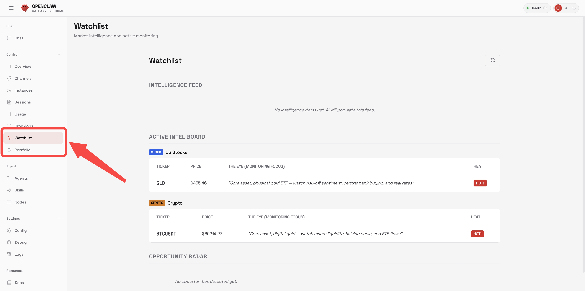

# ClawCapital — AI 模拟交易沙盒

**ClawCapital** 给你配一个 7×24 在线的专属 AI 基金经理。$10 万模拟资金，美股、加密货币、最高 150 倍杠杆永续合约、美股期权——全部接入实时行情，你定方向，AI 负责研究、执行和复盘。

> 基于 OpenClaw 的 Fork。`main` 分支与上游同步，所有交易功能在 [`clawcapital`](../../tree/clawcapital) 分支。

<p align="center">
  
</p>

## 为什么做 ClawCapital？

你有一个专属的 AI 基金经理——它盯盘、研究、执行交易、记录每笔决策的逻辑，而你随时可以审查持仓、调整策略、或者直接下指令。没有真钱风险，先让它用模拟盘证明自己。

## 4 条产品线，1 个资金池

所有产品共享同一笔资金。你可以买 AAPL 股票、开 50 倍 BTC 多单、再买 NVDA 看跌期权对冲——全在同一个 $10 万账户里完成。

| 产品线           | 标的                            | 方向                   | 杠杆     | 数据源           |
| ---------------- | ------------------------------- | ---------------------- | -------- | ---------------- |
| **美股现货**     | AAPL, NVDA, TSLA...             | 只做多                 | 1x       | Yahoo Finance    |
| **加密现货**     | BTC, ETH, SOL...                | 只做多                 | 1x       | Binance          |
| **加密永续合约** | BTC-PERP, ETH-PERP...           | 多/空                  | 1x–150x  | Binance          |
| **美股期权**     | NVDA Call/Put, AAPL Call/Put... | 买涨(Call) / 买跌(Put) | 内含杠杆 | Yahoo + 简化 BSM |

### 加密永续合约

核心玩法。AI 可以做多或做空加密货币，杠杆自由调节。

- **逐仓保证金** —— 每个仓位风险独立，一个仓爆了不会拖垮整个账户
- **分档维持保证金** —— 对齐 Binance 标准（按名义价值分档：0.4%–2.5%）
- **自动强平** —— 后台每 10 秒检查价格，触及强平价立即平仓
- **ROE 追踪** —— 10 倍杠杆 + 价格涨 5% = 本金回报 50%

```
示例：做多 1 BTC @ $60,000，20 倍杠杆
  所需保证金：$3,000
  BTC 涨到 $63,000：盈亏 = +$3,000，ROE = +100%（本金翻倍）
  BTC 跌到 $57,000：盈亏 = -$3,000，ROE = -100% → 触发强平
```

### 美股期权

简化版期权，实时定价。买 Call 看涨，买 Put 看跌。最大亏损 = 权利金，不需要保证金，不会被强平。

- **自动生成期权链** —— 行权价以当前股价为中心，4 个到期日（周期权 + 月期权）
- **简化 BSM 定价** —— 内在价值 + 时间价值，每只股票有独立隐含波动率（NVDA 45%、GME 80%、AAPL 25%）
- **自动到期结算** —— 每小时检查到期期权，实值期权自动返还差价，虚值期权归零
- **时间衰减** —— 权利金随到期日临近自然衰减

```
示例：买入 2 张 NVDA $850 Put，NVDA 当前 $800，30 天到期
  权利金：~$103/股 × 100 × 2 = ~$20,600
  NVDA 跌到 $700：
    内在价值：($850-$700) × 100 × 2 = $30,000
    盈利：$30,000 - $20,600 = +$9,400
  NVDA 到期仍高于 $850：
    期权作废，亏损 = $20,600（最多亏这么多）
```

## 好玩在哪？

**AI 全自动交易。** 给 OpenClaw 配上交易工具，它会自己研究行情、执行交易、记录每笔操作的理由。每个持仓都有"故事"——投资论点、备忘录、完整的交易时间线和推理过程。

**真行情，假钞票。** 加密货币走 Binance 实时价格（7×24），美股走 Yahoo Finance。每笔交易按真实市价成交，只是钱是假的。

**AI 盯盘看板。** AI 自主维护一个 Watchlist，给每个标的设定监控焦点（"盯着 AAPL 等 $180 突破"）、热度评级（冷/温/热），还会主动推送市场情报和分析。

**组合管理仪表盘。** Portfolio 页面分 4 个子标签：总览 → 现货 → 合约 → 期权。仓位行可展开查看投资论点、交易时间线、强平预警。

## AI 工具一览

AI 在对话中自主调用这些工具：

| 工具                                       | 功能                           |
| ------------------------------------------ | ------------------------------ |
| `portfolio_get`                            | 查看所有持仓、现金、各产线盈亏 |
| `portfolio_buy` / `portfolio_sell`         | 现货买卖（美股 + 加密）        |
| `portfolio_set_meta`                       | 给持仓写投资论点和备忘录       |
| `market_data_quote`                        | 获取任意标的实时价格           |
| `futures_open_long` / `futures_open_short` | 开多/开空，支持杠杆            |
| `futures_close`                            | 平仓（部分或全部）             |
| `futures_set_leverage`                     | 设置杠杆（1x–150x）            |
| `futures_get`                              | 查询合约仓位、保证金、强平价   |
| `options_buy`                              | 买入看涨/看跌期权              |
| `options_sell`                             | 到期前卖出期权                 |
| `options_chain`                            | 浏览期权链（行权价 + 权利金）  |
| `options_quote`                            | 查询指定合约的权利金报价       |
| `options_get`                              | 查询期权持仓和盈亏             |
| `watchlist_add` / `watchlist_remove`       | 管理自选股                     |
| `watchlist_update`                         | 更新监控焦点和热度             |
| `watchlist_add_intel`                      | 推送市场情报                   |

## 快速开始

```bash
git clone <this-repo>
cd ClawCapital && git checkout clawcapital

pnpm install && pnpm ui:build && pnpm build

pnpm openclaw onboard --install-daemon
pnpm openclaw gateway --port 18789
```

打开 `http://localhost:18789`，侧边栏有 Portfolio 和 Watchlist 页面。

数据存储在 `~/.openclaw/`：

```
portfolio.json           # 现货持仓和交易记录
futures-positions.json   # 合约仓位和杠杆设置
options-positions.json   # 期权仓位
watchlist.json           # 自选股和情报流
```

## 和 OpenClaw 有什么不同？

OpenClaw 是一个多渠道 AI 助手框架（WhatsApp、Telegram、Slack、Discord、语音、定时任务、技能扩展等）。ClawCapital 在此基础上加了完整的模拟交易层：

| 维度       | OpenClaw                     | ClawCapital                              |
| ---------- | ---------------------------- | ---------------------------------------- |
| 核心定位   | 多渠道 AI 助手               | AI 基金经理                              |
| 交易能力   | 无                           | 4 条产品线 + 实时行情                    |
| 投资组合   | 无                           | $10 万模拟账户 + 盈亏追踪                |
| 永续合约   | 无                           | 1x–150x 杠杆 + 自动强平                  |
| 期权       | 无                           | 美股期权 + BSM 定价 + 到期自动结算       |
| 自选股     | 无                           | AI 维护的盯盘看板 + 情报流               |
| Agent 工具 | 消息、网页、浏览器、定时任务 | 全部 OpenClaw 工具 + 17 个交易工具       |
| 后台任务   | Cron 定时任务                | + 强平引擎（10 秒） + 期权结算（1 小时） |
| 仪表盘 UI  | Gateway 控制面板             | + Portfolio 多标签 + Watchlist 页面      |

消息通道、语音、Canvas、浏览器、定时任务、技能扩展等全部来自 OpenClaw 上游。

## 项目结构

```
src/
├── portfolio/              # 现货交易引擎、行情接口、Portfolio 类
├── futures/                # 永续合约引擎、保证金计算、强平引擎
├── options/                # 期权引擎、BSM 定价、期权链生成
├── watchlist/              # AI 自选股看板（热度 + 情报）
├── account/                # 统一账户模型
├── agents/tools/           # Agent 工具定义（TypeBox Schema）
│   ├── portfolio-tools.ts  #   现货 买/卖/查/备注/报价
│   ├── futures-tools.ts    #   开多/开空/平仓/杠杆/持仓
│   └── options-tools.ts    #   买入/卖出/期权链/报价/持仓
├── gateway/server-methods/ # WebSocket RPC 接口
│   ├── portfolio.ts        #   portfolio.get/reset/transactions
│   ├── futures.ts          #   futures.open/close/positions/leverage/account
│   ├── options.ts          #   options.buy/sell/positions/chain/quote
│   └── watchlist.ts        #   watchlist.get/add/remove/update/intel
└── gateway/server.impl.ts  # 强平轮询（10 秒）+ 期权到期结算（1 小时）

ui/src/ui/
├── controllers/portfolio.ts  # Portfolio 数据接口定义
└── views/
    ├── portfolio.ts          # Portfolio 页面（总览/现货/合约/期权 标签页）
    └── watchlist.ts          # Watchlist 页面（情报流、标的看板、机会雷达）
```

## 开源协议

MIT —— 与 OpenClaw 一致。
